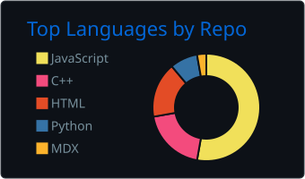
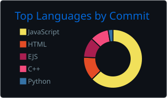
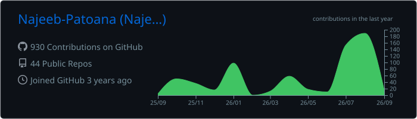

<h1 align="center">Hi 👋, I'm Najeeb Ullah Khan</h1>
<h3 align="center">Software Engineer | Full-Stack (MERN) Developer | DevOps Enthusiast</h3>

  
  
  

  I am a final-year Software Engineering student based in Pakistan, specializing in building high-performance systems that bridge the gap between hardware, scalable backends, and modern frontend interfaces. With a background in teaching Computer Science, I focus on delivering clean, resilient, and well-documented solutions.

---

### 🚀 What I'm Up To

- 🔭 **Currently working on:** An AI-Powered Rooftop Solar Design & Cost Estimation platform using the MERN stack, Python, and the Segment Anything Model (SAM).
- 🌱 **Currently expanding my skills in:** Advanced DevOps (Docker, Jenkins, CI/CD pipelines) and Site Reliability Engineering (SRE).
- 💡 **I love building:** Cross-platform mobile apps (Flutter), robust database-driven platforms, and embedded systems.
- 💬 **Ask me about:** React, Node.js, C++, Flutter, and optimizing system architectures.
- 📫 **How to reach me:** <a href="mailto:najeebpatoana007@gmail.com" target="_blank">najeebpatoana007@gmail.com</a>

---

### 🏆 Featured Projects

| Project | Description | Tech Stack |
| :--- | :--- | :--- |
| <a href="https://github.com/Najeeb-Patoana/Solar-Planner" target="_blank">☀️ **Solar Planner**</a> | Full-stack AI platform using SAM for rooftop detection and OCR for bill analysis. | `MERN`, `Python`, `Docker` |
| <a href="https://github.com/Najeeb-Patoana/Vector-Law-Legal-Chatbot" target="_blank">⚖️ **VectorLaw**</a> | Relational database-backed legal query assistant chatbot using vector stores and GovInfo API. | `Qdrant`, `PostgreSQL`, `Python` |
| <a href="https://github.com/Najeeb-Patoana/SolarPlanner-DualEnergyMonitor" target="_blank">📡 **Hardware Telemetry System**</a> | Dual-channel hardware telemetry logging system utilizing PZEM-004T v4 power monitoring modules. | `ESP32-S3`, `C++`, `IoT` |
| <a href="https://github.com/Najeeb-Patoana/Fuelly" target="_blank">⛽ **Fuelly App**</a> | On-demand fuel delivery mobile app with real-time GPS tracking and offline-first database sync. | `Flutter`, `Firebase` |
| <a href="https://github.com/Najeeb-Patoana/Code-Sniffer" target="_blank">🔍 **Code Sniffer**</a> | Static code analysis platform to detect structural anti-patterns and code smells via Abstract Syntax Trees. | `JavaScript`, `AST` |

---

### 🛠️ Languages and Tools

  

---

### 📊 Developer Activity

  
  

  

### 📊 Top Languages

  
  

  

